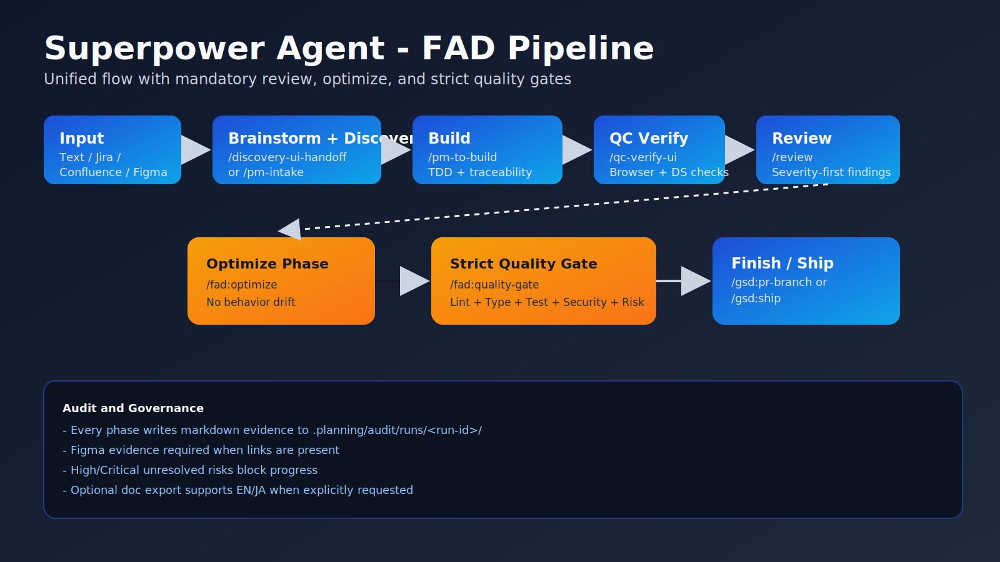

# Superpower Agent

Adaptive PM -> Build -> QC -> Ops agent system for **Claude, Codex, and Cursor**.

`superpower-agent` gives teams a repeatable delivery operating system instead of ad-hoc prompting.
It is a custom FAD-branded system built by extracting and adapting the strongest ideas from:

- [get-shit-done](https://github.com/gsd-build/get-shit-done)
- [Product-Manager-Skills](https://github.com/deanpeters/Product-Manager-Skills)
- [gstack](https://github.com/garrytan/gstack)

This repo is not a fork. It repackages the useful patterns into one leaner install surface, one branded command namespace, and one stricter PM -> Build -> QC -> Ops pipeline.

[](https://www.npmjs.com/package/superpower-agent)
[](./LICENSE)



## Why This Exists

Most agent setups stop at prompt collections or copy entire upstream stacks into every project.
Superpower Agent takes a different approach:

- keep the PM -> Build -> QC -> Ops handoff explicit
- keep every major decision auditable
- keep brownfield risk and impact analysis mandatory
- keep Figma/Jira/Confluence/PR inputs first-class
- keep install size and context footprint under control
- keep one default surface: `/fad:*`

## Why Teams Use It

- Turn rough requirements into structured delivery artifacts.
- Enforce brownfield-safe coding decisions with risk/impact gates.
- Run one strict pipeline (`/fad:pipeline`) with mandatory review and optimize phases.
- Keep one auditable flow from planning to deploy.
- Run consistent workflows across Claude, Codex, and Cursor.
- Use branded command namespace: **`/fad:*`**.

## Install In 60 Seconds

```bash
npx superpower-agent init --dir /path/to/your-project
```

Bundle-aware install:

```bash
npx superpower-agent init --dir /path/to/your-project --bundle standard
npx superpower-agent init --dir /path/to/your-project --bundle core
npx superpower-agent init --dir /path/to/your-project --bundle full
```

During install, the CLI asks which runtime adapters to configure:
- Claude
- Codex
- Cursor

Non-interactive examples:

```bash
npx superpower-agent init --dir /path/to/your-project --claude --codex --cursor --no-prompt
npx superpower-agent doctor --dir /path/to/your-project
npx superpower-agent estimate --bundle standard
npx superpower-agent inspect --dir /path/to/your-project
```

## Command Namespace

- Primary namespace: `/fad:*`
- Legacy `/gsd:*` aliases remain available for migration only
- `full` bundle restores the heavy legacy vendor tree from packaged archives on demand

Start here after install:

```text
/fad:help
/fad:pipeline "<requirement or phase>"
```

## What Gets Installed

- `CLAUDE.md`
- `.claude/` workflows, scripts, rules, hooks, commands
- `.planning/` artifacts, install metadata, and audit scaffolding
- `.planning/setup/context-index.json` for local context visibility
- `.claude-analysis/` audit packs in `standard` and `full`
- `templates/vendor/*.tgz` are used internally so npm publish stays lean while `full` still extracts legacy assets
- Runtime adapters:
  - `.codex/skills/fad-operator/SKILL.md` (if Codex selected)
  - `.cursor/rules/fad.mdc` (if Cursor selected)

## Optimization Highlights

- Bundle-aware install with `core`, `standard`, and `full`
- Local context visibility with `superpower-agent estimate` and `superpower-agent inspect`
- Project-local context index written to `.planning/setup/context-index.json`
- Publish surface reduced from the raw vendor-tree approach to a lean npm artifact
- `full` compatibility preserved through archive-backed extraction instead of shipping the entire legacy tree raw

Current packaging result after optimization:

- publish artifact: `185 files`
- unpacked package size: about `4.2 MB`
- `full` bundle still restores legacy assets when explicitly requested

## Architecture Snapshot

```text
Input (text / Jira / Confluence / Figma / PR)
  -> /fad:pipeline
  -> PM lane (intake, discovery, PRD, roadmap)
  -> Build lane (plan to execution, fix loops)
  -> Review lane (severity-first findings)
  -> Optimize lane (maintainability/perf hardening)
  -> Strict quality lane (lint/typecheck/test + security + risk)
  -> Ops lane (health, deploy, incident, rollback)
       \-> gates: risk + review + optimize + quality + security + health + design evidence
```

## Runtime Support Matrix

| Runtime | Install Mode | Adapter |
|---|---|---|
| Claude | Native | `.claude` command contracts |
| Codex | Adapter | `.codex/skills/fad-operator/SKILL.md` |
| Cursor | Adapter | `.cursor/rules/fad.mdc` |

## Professional Docs

- [Architecture](./docs/ARCHITECTURE.md)
- [Bundles](./docs/BUNDLES.md)
- [Commands](./docs/COMMANDS.md)
- [Workflows](./docs/WORKFLOWS.md)
- [FAD Pipeline](./docs/FAD_PIPELINE.md)
- [Audit Logging](./docs/AUDIT_LOGGING.md)
- [Onboarding](./docs/ONBOARDING.md)
- [Configuration](./docs/CONFIGURATION.md)
- [GitHub Setup](./docs/GITHUB_SETUP.md)
- [Releasing](./docs/RELEASING.md)

## References

- [get-shit-done](https://github.com/gsd-build/get-shit-done)
- [Product-Manager-Skills](https://github.com/deanpeters/Product-Manager-Skills)
- [gstack](https://github.com/garrytan/gstack)

## Maintainers

```bash
npm run check
npm run vendor:refresh
npm run sync-template
npm run export-standalone -- /tmp/superpower-agent-repo
```

## Publish

```bash
npm run check
npm publish --access public
```

## License

MIT - see [LICENSE](./LICENSE).
